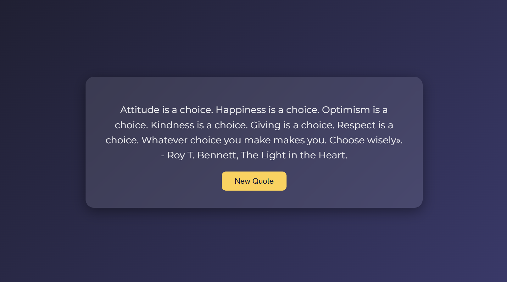

Daily Motivational Quotes Web Application

Description

The Daily Motivational Quotes Web Application is a simple and interactive tool designed to inspire and uplift users with a new motivational quote every time they click the button.  

It provides a clean, user-friendly interface where users can:  
- Read a daily motivational quote  
- Click a button to display a new random quote  
- Enjoy smooth animations for both the container and the button, creating an engaging experience  

The application uses subtle animations to make the experience more dynamic, including:  
- Fade and scale-in for the main container  
- Spin and bounce effects for the “New Quote” button  
- Slide and scale effects when a new quote appears 

Live Demo

https://motivational-quotes-daily.netlify.app/

Screenshot

Technologies Used

- JavaScript  
- GSAP (GreenSock Animation Platform)  
- HTML  
- CSS

How to Run the Project

No additional setup is required.

1. Clone the repository:
 bash 
git clone https://... 

2. Open the project folder and open `index.html` in your browser.

Challenges and Learnings

One of the main challenges in this project was integrating GSAP animations smoothly without conflicting with the container's opacity and layout.

This project strengthened my understanding of:

- DOM manipulation using JavaScript
- Randomized content selection
- Using GSAP for professional, smooth animations
- Combining interactivity and design for better user experience

Future improvements could include:

- Adding more quotes dynamically from an external API
- Allowing users to share quotes on social media

